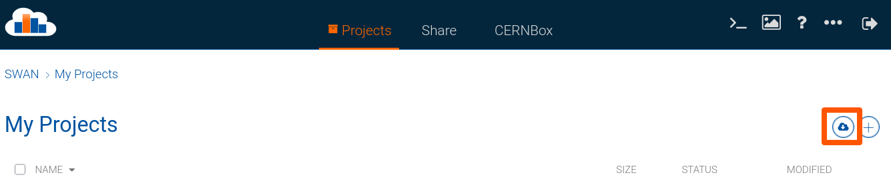

# Exercise Repo for iCSC 2026
# Speed Without The Pain: Accelerating Python With Numba

## Overview

This git repo has the exercises accompanying the talk "Speed Without The Pain: Accelerating Python With Numba" delivered at the Inverted CERN School of Computing 2026.

For more information on the session, see the listing on the Indico site (this should include the presentation materials and, after the school, this may include a recording of the session):

Lecture 1:
https://indico.cern.ch/event/1595114/contributions/6914179/

Lecture 2:
https://indico.cern.ch/event/1595114/contributions/6915161/

You can also view the slides from the session on GitHub pages (useful for copying code snippets):

https://kiranjonathan-dev.github.io/ICSC26_Accelerating_Python_With_Numba_Lecture_Slides/

## Exercise Structure

### How The Exercises Are Split

The exercises are split across 4 Jupyter Notebooks in the `./exercises` folder:

| Notebook | Topic                               |
| -------- | ----------------------------------- |
| 0        | Introduction and environment checks |
| 1        | NumPy refresher                     |
| 2        | Numba exercises                     |
| 3        | Trial optimisation challenge        |

Across these exercises, you should learn:
- How to use NumPy and Numba to accelerate Python code
- Some of the common pitfalls/errors when using Numpy and Numba
- How to time and test numerical code
- How to apply NumPy and Numba in a "real-world" optimisation problem with the help of `CProfile` and `snakeviz`

### How To Approach The Exercises

You're welcome to work alone if you'd prefer, but for best results I'd recommend pairing up and going through the exercises together.

I'd highly recommend going through the exercise books **in order**. The NumPy refresher may be on the easier side if you're familiar with NumPy, but you may learn something and that just means it won't take you too long!

Don't worry if you don't get a chance to finish all the exercises either, go through them at your own pace and ask questions if anything isn't clear. 

You can also always contact me at [kiran.jonathan@stfc.ac.uk](mailto:kiran.jonathan@stfc.ac.uk) if you have any questions after the school!

## Technical Setup

Here's how to get the exercises running!

**Note For Best Results:**

If you already have Python installed (and even better, Jupyter), then I'd **strongly** recommend running the exercises on your own laptop/computer. 

This will give you much more consistent timings when you're performance benchmarking.

### Your Own Machine

Make sure you have [Python 3](https://www.python.org/downloads/) and [JupyterLab](https://jupyter.org/install) installed.

In your terminal of choice, make a directory for the exercises and enter it.

Clone the repository:
```sh
git clone
```

Enter the main directory
```sh
cd 
```

And start Jupyter Notebook:

```sh
jupyter notebook
```

This should open in a new tab in your browser. Open the `exercises` folder and start from `Ex0_Setup_And_Introduction.ipynb`.

### Swan/CERN Infrastructure

**Note:** If you are able to run locally on your own laptop/device, I highly recommend it for best results when timing and profiling.

Login at https://swan.cern.ch

Click `Start new session`

**Make sure you select the `Use Python packages installed on CERNBox` option!**

This is a required step so that you can `pip` install the required dependencies

Change `CPU` from 2 to 4 (so we have more CPUs for the parallel benchmarking)

And click `Start new session` at the bottom.

You should now be at the `Project` page.

Click the `Cloud Symbol` which says `Download Project from git` when you hover over it:



You should now have the repo cloned and open! Open the `exercises` folder and start from `Ex0_Setup_And_Introduction.ipynb`.
